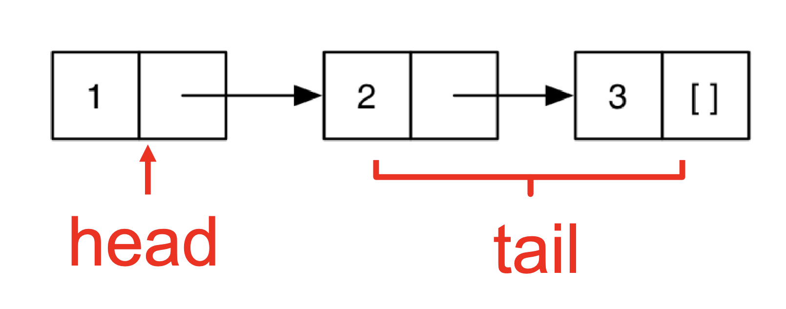
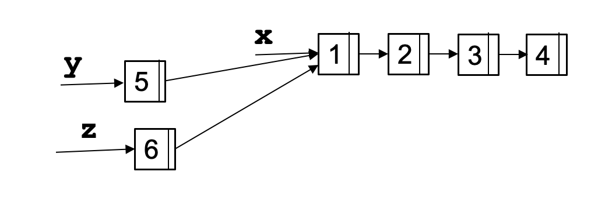

import { Fragment } from 'astro/jsx-runtime';
import { Code } from 'astro-expressive-code/components';
import Quiz from '@components/quiz/Quiz.astro';
import QuizReview from '@components/quiz/QuizReview.astro';

OCaml is a dialect of the ML programming language family, originally developed at INRIA in France. The features of ML include:

- First-class functions: Functions are treated as values. They can be passed as arguments to other functions and returned as results.
- Immutability by default: Variables are typically assigned once, encouraging a functional style of programming.
- Algebraic data types and pattern matching: These provide expressive and concise ways to define and manipulate structured data.
- Type inference
  - OCaml is statically typed, but there is no need to write type annotations explicitly.
  - The language supports parametric polymorphism, similar to Generics in Java, templates in C++
- Exceptions
- Automatic garbage collection

Many ideas from functional programming have since influenced modern programming languages, including first-class and anonymous functions, as well as automatic memory management through garbage collection.

## 2.1 Books

Below is a list of free online books available on OCaml.

- Developing Applications with Objective Caml [https://caml.inria.fr/pub/docs/oreilly-book/ocaml-ora-book.pdf](https://caml.inria.fr/pub/docs/oreilly-book/ocaml-ora-book.pdf)
- Introduction to the Objective Caml Programming Language [http://courses.cms.caltech.edu/cs134/cs134b/book.pdf](http://courses.cms.caltech.edu/cs134/cs134b/book.pdf)
- Real World OCaml 2nd Edition [https://dev.realworldocaml.org/](https://dev.realworldocaml.org/)
- OCaml from the Very Beginning [https://johnwhitington.net/ocamlfromtheverybeginning/mlbook.pdf](https://johnwhitington.net/ocamlfromtheverybeginning/mlbook.pdf)
- Cornell cs3110 book [https://cs3110.github.io/textbook/cover.html](https://cs3110.github.io/textbook/cover.html) is another course which uses OCaml; it is more focused on programming and less on PL theory than this class is.
- [ocaml.org](https://ocaml.org/) is the home of OCaml for finding downloads, documentation, etc. The tutorials are also very good and there is a page of books.
- [OCaml exercises](https://ocaml.org/exercises)

### 2.1.1 Similar Courses

If you're interested, I've listed several similar courses from other universities. For example, Cornell offers a comparable course—CS 3110—and there are also similar offerings from the University of Washington, Princeton, Harvard, and UIUC. You can check out their websites; Cornell's, in particular, provides an online textbook along with videos and other helpful resources.

You might find it helpful to watch their lectures, go through their examples, or even try out their projects or exams. They all use OCaml, and the course structure is quite similar.

So, it's more than just a textbook—you have access to notes, slides, exams, and other useful materials.

- [CS3110](https://www.cs.cornell.edu/courses/cs3110/2025sp/) (Cornell)
- [CSE341](https://courses.cs.washington.edu/courses/cse341/) (Washington)
- [601.426](https://pl.cs.jhu.edu/pl/) (Johns Hopkins)
- [COS326](https://www.cs.princeton.edu/courses/archive/fall23/cos326/) (Princeton)
- [CS152](https://groups.seas.harvard.edu/courses/cs152/) (Harvard)
- [CS421](https://courses.engr.illinois.edu/cs421/) (UIUC)

## 2.2 Installing OCaml

```bash output
ocaml --version
=== OUTPUT ===
The OCaml toplevel, version 5.4.1
```

## OPAM: OCaml Package Manager

Opam is the package manager for OCaml. It manages libraries and different compiler installations. For the class projects, you should install the following packages with **opam**.

- ounit, a testing framework similar to minitest
- utop, a top-level interface
- dune, a build system for larger projects

```bash output
dune --version
=== OUTPUT ===
3.23.1
```

## 2.4 Running OCaml Programs

You can compile OCaml programs with either the bytecode compiler (**ocamlc**) or the native-code compiler (`ocamlopt`). The -o option specifies the output file name.

```bash title="Create a file named main.ml" frame="terminal"
ocamlc -o main main.ml
```

`ocamlc -c` compiles the source file without linking and produces **.cmo** (compiled object) and **.cmi** (compiled interface) files. `ocamlopt` produces **.cmx** files, which contain native code: faster, but not platform-independent (or as easily debugged)

```bash
ocamlopt -o main main.ml
```

`asd` You can also run an OCaml program directly using the OCaml interpreter (**ocaml**). This is similar to running a Python program.

```bash
ocaml main.ml
```

This will run the OCaml program **main.ml**.

## 2.5 Building Projects with dune

**ocamlc** is convenient for compiling a single OCaml file. However, for class projects you will use **dune**, the build system. Dune automatically discovers dependencies and invokes the compiler and linker for you. Let us create a new project using **dune**:

```bash output
dune init project HelloWorld
=== OUTPUT ===
Success: initialized project component named HelloWorld
```

```bash title="HelloWorld project" frame="terminal" output
tree HelloWorld
=== OUTPUT ===
HelloWorld
├── bin
│   ├── dune
│   └── main.ml
├── dune-project
├── HelloWorld.opam
├── lib
│   └── dune
└── test
    ├── dune
    └── test_HelloWorld.ml

4 directories, 7 files
```

```bash frame="none"
# Build the project
cd HelloWorld
dune build

# Run the project
dune exec bin/main.exe # OR "_build/default/bin/main.exe"

# AND/OR run the tests
dune runtest
```

## 2.6 OCaml Basics

OCaml files are written with a **.ml** extension. There is no special main function. An OCaml file consists of:

- A series of open statements for including other modules
- A series of declarations for defining datatypes, functions, and constants
- A series of (though often just one) toplevel expressions to evaluate.

```ocaml output
(* A small OCaml program *)
print_string "Hello world!\n";;
=== OUTPUT ===
Hello world!
- : unit = ()
```

Or

```ocaml output
open Printf
  let message = "Hello world";;
  (printf "%s\n" message);;
=== OUTPUT ===
val message : string = "Hello world"
Hello world
- : unit = ()
```

The first line includes the built-in library for printing, which provides functions similar to `fprintf` and `printf` from `stdio.h` in **C**. The next two lines define a constant named message, and then call the `printf` function with a format string (where %s means "format as string"), and the constant message we defined on the line before.

To compile and run shell

```bash output
ocamlc hello.ml -o hello
./hello
Hello world!
```

We can also compile multiple files to generate a single executable.

```ocaml title="main.ml"
(* main.ml *)
let main () =
  print_int (Util.add 10 20); print_string "\n"
let () = main ()
```

```ocaml title="util.ml"
(* util.ml *)
let add x y = x + y
```

Compile and run:

```bash
ocamlc util.ml main.ml -o main
```

Or compile separately:

```bash
ocamlc -c util.ml
ocamlc util.cmo main.ml
```

It generates an executable main. We can execute it by:

```bash output
shell ./main
=== OUTPUT ===
30
```

## 2.7 OCaml toplevel, a REPL for OCaml

We will begin exploration of OCaml in the interactive top level. A top level is also called a read-eval-print loop (REPL) and it works like a terminal shell. To run the ocaml toplevel, simply run ocaml

```bash output
ocaml
=== OUTPUT ===
    OCaml version 5.4.0

(* Must close function calls with ;; to run it *)
# print_string "Hello world!\n";;

Hello world!
- : unit = ()

(* Load a .ml file into the top level *)
# use "hello.ml";;

Hello world!
- : unit = ()
```

To exit the top-level, type ^D (Control D) or call `exit 0;;`.

There is an alternative toplevel called **utop**. It is more user friendly, and we will be using `utop` in the class. You can install **utop** by running `opam install utop`. Follow the instructions in the project 0 for installing opam and ocaml.

## First OCaml Example

```ocaml output
(* A small OCaml program (* with nested comments *) *)
 let x = 37;;
 let y = x + 5;;
 print_int y;;
=== OUTPUT ===
val x : int = 37
val y : int = 42
42
- : unit = ()
```

OCaml comments start with `(*` and end with `*)`. Comments can be nested. OCaml is strictly typed. It does not implicitly cast types. For example, `print_int` only prints `int`.

```ocaml output
print_int 10;;
=== OUTPUT ===
10
- : unit = ()
```

The `unit = ()` is the return value of the `print_int` function. `()` is called **unit**. It is similar to `void` in other languages. It means the `print_int` function returns nothing. The following expressions do not type check

```ocaml output del={1}
print_int 10.5;;
=== OUTPUT ===
Line 1, characters 10-14:
1 | print_int 10.5;;
              ^^^^
Error: The constant 10.5 has type float
       but an expression was expected of type int
```

because print_int does not take float as an argument.

The following code does not typecheck because + operator requires both operands to be integers. Adding a float to an integer results in a type error.

```ocaml output del={1}
1 + 0.5;;
=== OUTPUT ===
Line 1, characters 4-7:
1 | 1 + 0.5;;
        ^^^
Error: The constant 0.5 has type float
       but an expression was expected of type int
```

Adding a boolean to an integer results in a type error too.

```ocaml output del={1}
1 + true;;
=== OUTPUT ===
Line 1, characters 4-8:
1 | 1 + true;;
        ^^^^
Error: The constructor true has type bool
       but an expression was expected of type int
```

And as expected, print_int does not take a string as an argument.

```ocaml output del={1}
print_int "This function expected an int";;
=== OUTPUT ===
Line 1, characters 10-41:
1 | print_int "This function expected an int";;
              ^^^^^^^^^^^^^^^^^^^^^^^^^^^^^^^
Error: This constant has type string
       but an expression was expected of type int
```

## 2.9 Expressions

In OCaml, expressions are the fundamental building blocks of programs, and evaluating an expression always produces a value. Unlike many imperative languages, which distinguish between statements (actions) and expressions (values), OCaml is expression-oriented—almost everything in the language is an expression that yields a result.

Every kind of expression has syntax and semantics. Semantics include:

- Type checking rules (static semantics): produce a type or fail with an error message
- Evaluation rules (dynamic semantics): produce a value or an exception or infinite loop. Evaluation rules are used only on expressions that type-check

We use metavariable e to designate an arbitrary expression.

## 2.10 Values

A value is an expression that is final. For example, `34` and `true` are values because we cannot evaluate them any further. On the contrary, `34+17` is an expression, but not a value because we can further evaluate it. Evaluating an expression means running it until it is a value. For example `34+17` evaluates to `51`, which is a value. We use metavariable `v` to designate an arbitrary value.

## 2.11 Types

Types classify expressions. It is the set of values an expression could evaluate to. Examples include `int`, `bool`, `string`, and more. We use metavariable `t` to designate an arbitrary type. Expression `e` has type `t` if `e` will (always) evaluate to a value of type `t`. For example `0`, `1`, and `-1` are values of type `int` while `true` has type `bool`. `34+17` is an expression of type `int`, since it evaluates to `51`, which has type `int`. We usually write `e : t` to say `e` has type `t`. The process of determining `e` has type `t` is called **type checking** simply, **typing**.

## 2.12 If expression

The syntax of the if expression is

```ocaml
if e1 then e2 else e3
```

We type check the `if` expression using the following type checking rules:

```math
\frac{\Gamma \vdash e_1 : \text{bool} \quad \Gamma \vdash e_2 : t \quad \Gamma \vdash e_3 : t}{\Gamma \vdash \texttt{if e1 then e2 else e3} : t}
```

This format is called inference rules. It is a formal way to express how you can derive a conclusion from premises. They're everywhere in logic, type systems, and formal proofs. Visually, an inference rule looks like this:

```math
\frac{\text{premise}}{\text{conclusion}}
```

- Premises (top part) — things you already know or assumptions.
- Conclusion (bottom part) — what follows logically from the premises.
- The line separates what's assumed from what's derived.

In plain English, it reads: In context Γ (Γ, "Gamma", is the type environment. It is a map of variables and their types.), if `e1` has type `bool`, and `e2` has type `t`, and `e3` has (the same) type `t` then the expression if `e1 then e2 else e3` has type `t`.

- Condition must be a `bool`: The expression `e1` (the condition) must have type `bool`. For example, writing `if 1 then ...` causes a type error, since `1` has type `int`, not `bool`.
- Then- and Else-branches must have the same type: Both `e2` and `e3` must evaluate to values of the same type.

```ocaml output
if 7 > 42 then "hello" else "goodbye";;
=== OUTPUT ===
- : string = "goodbye"
```

The following expression does not type check because the two branches of the `if` expression do not return the same type. The `true` branch returns `string`, while the `false` branch returns `int`.

```ocaml output del={1}
if 7 > 42 then "hello" else 10;;
=== OUTPUT ===
Line 1, characters 28-30:
1 | if 7 > 42 then "hello" else 10;;
                                ^^
Error: The constant 10 has type int
       but an expression was expected of type string
```

Evaluating an **if** expression returns a value. For example:

```ocaml output
if 10 > 5 then 100 else 200;;
=== OUTPUT ===
- : int = 100
```

{/* DEMO: using Code in Quiz Component */}

<Quiz question="To what value does this expression evaluate?" options={['0', '1', '2', 'Error']} correctOption={2}>
	<Code slot="questionSlot" code="if 10 < 20 then 1 else 2" lang="ocaml" />
	Answer: 2. Since `10 < 20` is true, the value of the if expression is equal to the value of the true branch.
</Quiz>

{/* DEMO: using code through MDX in Quiz Component */}

<Quiz question="To what value does this expression evaluate?" options={['10', '20', '()', 'Error']} correctOption={2}>
	<Fragment slot="questionSlot">
	```ocaml
	if 10 > 20 then print_int 10
	```
	</Fragment>
	Answer: Unit (). Since `print_int 10` returns unit, we did not need to include an else branch.
</Quiz>

## 2.13 Functions

OCaml functions are like mathematical functions. They compute a result from provided arguments. We use let to define a function:

We now define the function **next**, which accepts an integer **n** and produces its successor.

```ocaml output
let next n = n + 1;;
	next 10;; (* call the function next with an argument 10 *)
=== OUTPUT ===
val next : int -> int = <fun>
- : int = 11
```

Here is another function Factorial:

```ocaml output
let rec fact n =
	if n = 0 then
		1
	else
		n * fact (n-1);;

fact 5;;
=== OUTPUT ===
val fact : int -> int = <fun>
- : int = 120
```

`rec` keyword is used to define **recursive** functions. `;;` ends an expression in the top-level of OCaml. We use it to say: "Give me the value of this expression". It is not used in the body of a function and it is not needed in the real OCaml development.

<QuizReview question="Quiz: Write a function sum that takes a positive integer n and returns the value of 1+2+3+...n.">
	```ocaml output
	let rec sum n = 
		if n = 1 then 1 else n + sum (n-1);; 
		sum 10;;
	=== OUTPUT ===
	val sum : int -> int = <fun>
	- : int = 55
	```
</QuizReview>

### 2.13.1 Calling Functions (Function Application)

In OCaml, calling a function is very straightforward — you just write the function name followed by its arguments, separated by spaces (not commas, and no parentheses are required unless for grouping). The calling syntax is:

```ocaml
f e1 e2 … en
```

Here is an example where we call the function `square` with the argument `5`.

```ocaml output
let square x = x * x;;
square 5;;
=== OUTPUT ===
val square : int -> int = <fun>
- : int = 25
```

Nullary functions (Functions with no arguments) are a little special compared to languages like C or Python. OCaml does not truly have "argument-less" functions. Instead, a nullary function is defined as one that takes the special value `()` of type `unit`.

```ocaml output
let greet () = "Hello";;
greet ();;
=== OUTPUT ===
val greet : unit -> string = <fun>
- : string = "Hello"
```

We evaluate a function call expression according to these steps:

- Locate the definition of **f**, i.e., `let rec f x1 … xn = e`.
- Evaluate the arguments `e1 … en` to obtain values `v1 … vn`.
- Substitute the values `v1 … vn` for the parameters `x1 … xn` in the function body `e`, yielding a new expression `e'`.
- Evaluate `e'` to value `v`, which is the final result

Following is an example of evaluating `fact 2`

```ocaml output
let rec fact n =
	if n = 0 then
		1
	else
		n * fact (n-1);;
=== OUTPUT ===
val fact : int -> int = <fun>
```

| Expression                                 | Semantics                                                       |
| ------------------------------------------ | --------------------------------------------------------------- |
| `fact (1+1)`                               | evaluate the argument 1+1                                       |
| `fact 2`                                   | substitute every occurrence of n inside the body of fact with 2 |
| `if 2=0 then 1 else 2*fact(2-1)`           | evaluate the if expression                                      |
| `2 * fact 1`                               | result of the else branch                                       |
| `2 * (if 1=0 then 1 else 1*fact(1-1))`     | substitute n with 1                                             |
| `2 * 1 * fact 0`                           | evaluate fact 0                                                 |
| `2 * 1 * (if 0=0 then 1 else 0*fact(0-1))` | base case                                                       |
| `2 * 1 * 1`                                |                                                                 |
| `2`                                        |                                                                 |

<Quiz question="To what value does this expression evaluate?" options={['5', '15', '45', '55']} correctOption={2}>
	<Fragment slot="questionSlot">
	```ocaml
	let rec mystery n m = if n > m then 0 else n + mystery (n+1) m;;
	mystery 5 10;;
	```
	</Fragment>
	Answer: 45. `mystery n m` computes the sum of the integers from n to m, inclusive. For example, mystery 5 10 = 45 (since 5 + 6 + 7 + 8 + 9 + 10 = 45)
</Quiz>

### 2.13.2 Function Types

In OCaml, → is the function type constructor. Type `t1 → t` is a function with argument or domain type `t1` and return or range type `t`. Type `t1 → t2 → t` is a function that takes two inputs, of types `t1` and `t2`, and returns a value of type `t`.

```ocaml output
(* function add takes two integer arguments and
		returns an integer value *)
let add x y = x + y;;
=== OUTPUT ===
val add : int -> int -> int = <fun>
```

```ocaml output
(* function greet takes a unit and returns a unit *)
let greet () = print_string "What's up?";;
=== OUTPUT ===
val greet : unit -> unit = <fun>
```

## Type Checking of Function Application

As we have seen before, the syntax of a function application is

```ocaml
f e1 … en
```

We use the following type checking rule for a single argument function application

```math
\frac{\Gamma \vdash f : t_1 \rightarrow t_2 \quad \Gamma \vdash e : t_1}{\Gamma \vdash f e : t_2}
```

It reads: if `f` has type `t1 → t2` and `e` has type `t1`, then `f e` has type `t_2`.

In general, we use the following type checking rule for a function application:

```math
\frac{\Gamma \vdash f : t_1 \rightarrow t_2 \rightarrow … \rightarrow t_n \rightarrow u \quad \Gamma \vdash e_1 : t_1 \quad \Gamma \vdash e_2 : t_2 \quad … \quad \Gamma \vdash e_n : t_n}{\Gamma \vdash f e_1 e_2 … e_n : u}
```

It reads: if `f : t1 → … → tn → u` and `e1 : t1, …, en : tn` then the type of `f e1 … en` is `u`.

For example: the type of `not true` is `bool` because `not : bool → bool` and `true : bool`.

```ocaml output
not;;
true;;
not true;;
=== OUTPUT ===
- : bool -> bool = <fun>
- : bool = true
- : bool = false
```

Another example: the type of `(+)` is `int → int → int`, the type of `1+2` and `3*4` are `int`. Therefore, the type of `(+) (1+2) (3 * 4)` is `int`.

```ocaml output
(+);; (* int -> int -> int *)
(1+2);;	(* int *)
(3*4);; (* int *)
(+) (1+2) (3*4);; (* int *)
(1+2) + (3*4);; (* int *)
=== OUTPUT ===
- : int -> int -> int = <fun>
- : int = 3
- : int = 12
- : int = 15
- : int = 15
```

### 2.14.1 More Examples on Function Type Checking

As illustrated by the preceding examples, OCaml does not require programmers to explicitly annotate types as in languages such as C or Java. Instead, OCaml employs the Hindley-Milner type system to automatically infer the types of expressions before performing type checking.

For example, the following function **double** multiplies its integer argument by two:

```ocaml output
let double x = x * 2;;
=== OUTPUT ===
val double : int -> int = <fun>
```

OCaml infers the type of double as `int → int` as follows: the operator \* denotes integer multiplication, so both of its operands must have type `int`. Therefore, x must have type `int`. Consequently, both the parameter type and the return type of double are `int`. In other words, **double** is a function that takes an `int` as input and returns an `int` as output.

```ocaml output
let double x = x * 2;;
double 10;;
=== OUTPUT ===
val double : int -> int = <fun>
- : int = 20
```

Calling `double` with an argument of a different type results in a type-checking error.

```ocaml output del={2}
let double x = x * 2;;
double 10.5;;
=== OUTPUT ===
val double : int -> int = <fun>
Line 1, characters 8-12:
1 |  double 10.5;;
            ^^^^
Error: The constant 10.5 has type float
       but an expression was expected of type int
```

The function **add** takes three integers as arguments, computes their sum, and returns an integer result.

```ocaml output
(* Adding three integers *)
let add x y z = x + y + z;;
=== OUTPUT ===
val add : int -> int -> int -> int = <fun>
```

The function **fn** takes a floating-point value as its argument, converts it to an integer, multiplies it by 3, and returns an integer result.

```ocaml output
let fn x = (int_of_float x) * 3;;
fn 2.5;;
=== OUTPUT ===
val fn : float -> int = <fun>
- : int = 6
```

In OCaml, `int_of_float` converts a floating-point value (float) to an integer (int).

```ocaml output
int_of_float 3.7;;     (* = 3 *)
int_of_float 3.0;;     (* = 3 *)
int_of_float (-3.7);;  (* = -3 *)
=== OUTPUT ===
- : int = 3
- : int = 3
- : int = -3
```

The following are more examples in which OCaml infers the type of a function:

```ocaml output
(* Greatest Common Divisor of Two Positive Integer Numbers *)
let rec gcd a b =
	if b = 0 then a else gcd b (a mod b);;
		(* mod: int → int → int. It implies a and b must be int.
			 The return type is int because it returns a *)
=== OUTPUT ===
val gcd : int -> int -> int = <fun>
```

```ocaml output
(* Sum of the first n natural numbers *)
let rec sum n =
	if n = 0 then 0 else n + sum (n-1);;
(* n=0 implies n must be int. Return type is int
	 because it returns 0 in one branch. *)
=== OUTPUT ===
val sum : int -> int = <fun>
```

```ocaml output
(* Prime Factors of a Given Positive Integer *)
let rec aux d n =
	if n = 1 then [] else
		if n mod d = 0 then
			d :: aux d (n / d)
		else aux (d + 1) n;;
let factors n = aux 2 n;;
factors 210;;
=== OUTPUT ===
val aux : int -> int -> int list = <fun>
val factors : int -> int list = <fun>
- : int list = [2; 3; 5; 7]
```

### 2.14.2 Mutually Recursive Functions

Mutually recursive functions are functions that call each other (directly or indirectly). You define them using the `and` keyword along with `let rec`.

Suppose we want two functions, `even` and `odd`, to determine whether a number is even or odd, with `even` calling `odd` and `odd` calling `even`. We define them together using `let rec` ... `and`

```ocaml output
let rec odd n =
		if n = 0 then false
		else even(n-1)
	and
		even n =
			if n = 0 then true
			else odd(n-1);;
even 100;;
odd 101;;
=== OUTPUT ===
val odd : int -> bool = <fun>
val even : int -> bool = <fun>
- : bool = true
- : bool = true
```

### 2.14.3 Polymorphic Types

In OCaml, a polymorphic type is a type that contains one or more type variables (written 'a, 'b, etc.), meaning the function or value can operate uniformly on values of many different types. A polymorphic function works for any type, not just one specific type. The following functions `swap` and `eq` are polymorphic functions. The types 'a and 'b can be read as **for all types a and b**

```ocaml output
(* Swap the elements of a tuple (we will cover tuples later) *)
let swap (x, y) = (y, x);;
=== OUTPUT ===
val swap : 'a * 'b -> 'b * 'a = <fun>
```

The function `eq x y` returns true if x and y are structurally equal, and false otherwise. It has type `'a -> 'a -> bool`, meaning that for any type `'a`, it takes two values of type `'a` and produces a boolean result.

```ocaml output del={8}
(* structural equality *)
let eq x y = x = y;;
eq 3 3;;           (* true *)
eq 1 2;;           (* false *)
eq "hello" "hello";; (* true *)
eq [1;2] [1;2];;   (* true *)
eq [1;2] [2;1];;   (* false *)
eq "hello" 1;;    (* type error *)
=== OUTPUT ===
val eq : 'a -> 'a -> bool = <fun>
- : bool = true
- : bool = false
- : bool = true
- : bool = true
- : bool = false
Line 1, characters 12-13:
1 |  eq "hello" 1;;    (* type error *)
                ^
Error: The constant 1 has type int
			 but an expression was expected of type string
```

The types `'a 'b` are basically generic types in Java. The Java version of the `eq` is:

```java
public static <T> boolean eq(T x, T y) {
	return x.equals(y);
}
```

<Quiz
  question="What is the type of the following function?"
  options={["'a -> 'b -> int", 'int', "'a -> 'a -> bool", "'a -> 'a -> int"]}
  correctOption={3}
>
  <Code slot="questionSlot" code="let f x y = if x = y then 1 else 0;;" lang="ocaml" />
  The function f takes two arguments of the same type `'a` and returns an `int` (1 or 0) based on whether they are
  equal.
</Quiz>

### 2.14.4 Type annotations

The OCaml compiler can infer types automatically, but type inference can be tricky and sometimes produces vague error messages. To avoid this, we can provide type annotations manually. Annotations are useful for clarity, documentation, and resolving ambiguities.

```ocaml output
let (x : int) = 3;;
=== OUTPUT ===
val x : int = 3
```

```ocaml output
let fn (x:int):float = (float_of_int x) *. 3.14;;
(* (x : int) explicitly states that x is an integer.
	 float states the return type is float *)
let add (x:int) (y:int):int = x + y;;
=== OUTPUT ===
val fn : int -> float = <fun>
val add : int -> int -> int = <fun>
```

```ocaml output
let id x = x;;
=== OUTPUT ===
val id : 'a -> 'a = <fun>
```

```ocaml output
let id (x:int) = x;;
(* This annotation constrains the function to take an int
	 as its argument and to return an int. *)
=== OUTPUT ===
val id : int -> int = <fun>
```

## 2.15 Lists

The list is a fundamental data structure in OCaml. Lists can have arbitrary length and are implemented as linked structures. All elements in a list must be of the same type (i.e., lists are homogeneous). We will learn how to construct lists and deconstruct them using pattern matching. In OCaml, `[ ]` is a value, represents an empty list. Elements are separated by semicolons.

```ocaml output
[];;
[1; 2; 3; 4];;
["apple"; "banana"; "cherry"];;
=== OUTPUT ===
- : 'a list = []
- : int list = [1; 2; 3; 4]
- : string list = ["apple"; "banana"; "cherry"]
```

To evaluate `[e1; e2;...;en]`, we evaluate `e1` to a value v1, `e2` to a value `v2`, and `en` to a value `vn`, and return `[v1;…;vn]`.

In OCaml, the list notation `[e1; e2]` is syntactic sugar for using the cons operator `::` (pronounced "cons"). `::` constructs a list by prepending an element to an existing list. Specifically:

```ocaml
[e1; e2];;  			(* syntactic sugar *)
e1 :: e2 :: [];;  (* desugared form *)
```

```ocaml output
let y = [1; 1+1; 1+1+1] ;;
let x = 4::y ;;
let z = 5::y ;;
let m = "hello" :: "bob" ::[];;
=== OUTPUT ===
val y : int list = [1; 2; 3]
val x : int list = [4; 1; 2; 3]
val z : int list = [5; 1; 2; 3]
val m : string list = ["hello"; "bob"]
```

### 2.15.1 Typing Lists

The type of an empty list `[ ]` is `'a list`. The type of **Cons** is

```math
\frac{\Gamma \vdash e_1 : t \quad \Gamma \vdash e_2 : t \text{ list}}{\Gamma \vdash e_1 :: e_2 : t \text{ list}} \quad \text{(T-Cons)}
```

It reads: if `e1 : t` and `e2 : t list` then `(e1::e2) : (t list)`.

```ocaml output
let l = [];;
let m = [[1];[2;3]];;
let w = ["apple"; "banana"; "watermelon"];;
=== OUTPUT ===
val l : 'a list = []
val m : int list list = [[1]; [2; 3]]
val w : string list = ["apple"; "banana"; "watermelon"]
```

```ocaml output
let y = 0::[1;2;3];;
=== OUTPUT ===
val y : int list = [0; 1; 2; 3]
```

```ocaml output del={1}
let x = [1;"world"] ;; (* all elements must have same type *)
=== OUTPUT ===
Line 1, characters 11-18:
1 | let x = [1;"world"] ;; (* all elements must have same type *)
               ^^^^^^^
Error: This constant has type string
			 but an expression was expected of type int
```

<Quiz
  question="What is the type of the following expression?"
  options={['array', 'list', 'int list', 'float list']}
  correctOption={3}
>
  <Code slot="questionSlot" code="[1.0; 2.0; 3.0; 4.0]" lang="ocaml" />
</Quiz>

<Quiz
  question="What is the type of the following expression?"
  options={['int', 'int list', 'int int list', 'error']}
  correctOption={1}
>
  <Code slot="questionSlot" code="10::[20]" lang="ocaml" />
</Quiz>

<Quiz
  question="What is the type of the function f?"
  options={['string -> string', 'string list', 'string list -> string list', 'string -> string list']}
  correctOption={3}
>
  <Code slot="questionSlot" code='let f x = x :: [\"hello\"];;' lang="ocaml" />
</Quiz>

### 2.15.2 `::` Operator

The `::` operator prepends a single item, not a list, to the front of another list. The left argument of `::` is an element, the right is a list

```ocaml output del={2}
let y = 0::[1;2;3] ;;
let w = [1;2]::y ;; (* error *)
=== OUTPUT ===
val y : int list = [0; 1; 2; 3]
Line 1, characters 16-17:
1 |  let w = [1;2]::y ;; (* error *)
                    ^
Error: The value y has type int list
			 but an expression was expected of type int list list
       Type int is not compatible with type int list
```

<QuizReview question="Quiz: What is the type of the following expression?">

Yes. If the type of `y` is `int list list`, i.e., `[1;2]::[[3;4]]`. Each element of this list is an `int list`.

```ocaml output
let y = [[3;4;5];[6]];;
[1;2]::y;;
=== OUTPUT ===
val y : int list list = [[3; 4; 5]; [6]]
- : int list list = [[1; 2]; [3; 4; 5]; [6]]
```

</QuizReview>

A nonempty list is a **pair (element, rest of list)**. The **element** is the head of the list, and **rest of the list** is itself a list. Thus in math (i.e., inductively) a list is either

- The empty list `[ ]`
- Or a pair consisting of an element and a list

This recursive structure will come in handy shortly. `[1;2;3]` is represented as:



### 2.15.3 Lists of Lists

Lists can be nested arbitrarily. For example:

```ocaml output
[ [9; 10; 11]; [5; 4; 3; 2] ];;
=== OUTPUT ===
- : int list list = [[9; 10; 11]; [5; 4; 3; 2]]
```

The type `int list list` can also be written as `(int list) list`.

Lists are immutable in OCaml; you cannot change an element of a list. Instead, you create new lists from existing ones, for example using the `::` operator.

```ocaml output
let x = [1;2;3;4];;
let y = 5::x;;
let z = 6::x;;
=== OUTPUT ===
val x : int list = [1; 2; 3; 4]
val y : int list = [5; 1; 2; 3; 4]
val z : int list = [6; 1; 2; 3; 4]
```

Since `x` refers to an immutable list, the tails of both `y` and `z` share the same list `x`.


